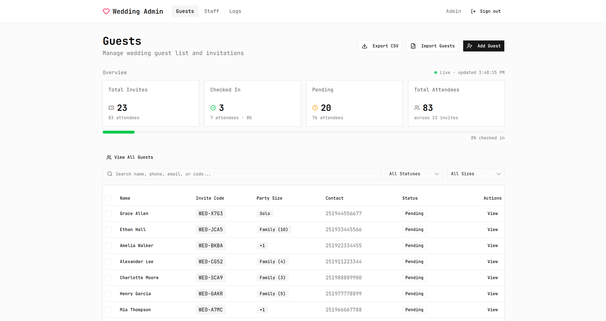
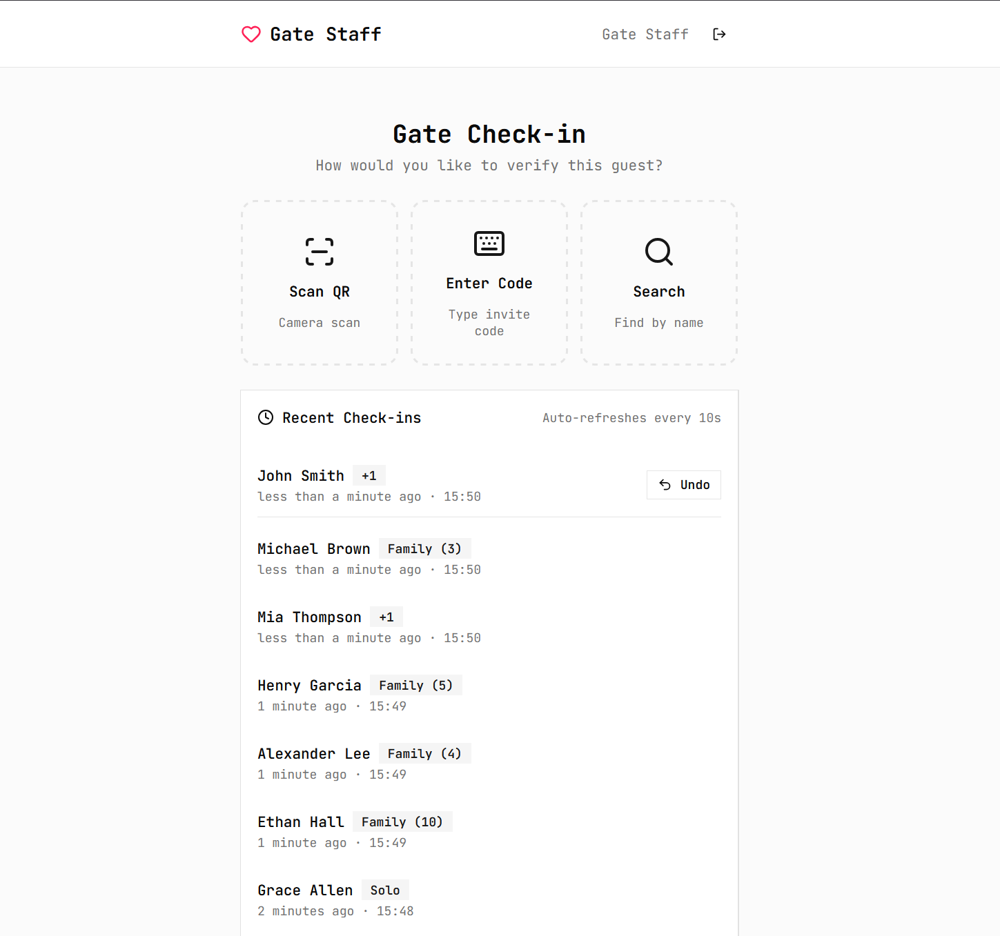

# Wedding Guest System

A check-in system for wedding day operations. Admins manage the guest list, invitations, and staff from a dashboard. Gate staff verify guests at the door using QR codes, invite codes, or name search.

---

## Screenshots

### Admin dashboard

> Add a screenshot of the admin guests page here (`docs/screenshots/admin-dashboard.png`).

### Gate check-in

> Add a screenshot of the gate check-in page here (`docs/screenshots/gate-checkin.png`).

---

## Who uses it

| Role | Access | Purpose |
|------|--------|---------|
| **Admin** | `/admin` | Manage guests, import/export data, view live stats, manage gate staff, review activity logs |
| **Gate staff** | `/gate` | Check guests in at the venue |

After login, each user is sent to the area that matches their role.

---

## Features

### Admin

- **Guest list** — View, search, and filter guests by status (pending / checked in) and party size
- **Add & edit guests** — Create guests manually with name, contact details, party size, and notes
- **Bulk import** — Upload a spreadsheet (CSV or Excel) to add many guests at once, with preview before import
- **Export** — Download the full guest list as a CSV
- **Live stats** — See invite and attendee counts, check-in progress, and pending guests (updates automatically)
- **Guest detail** — View invite code, QR code, check-in status, who checked them in, and when
- **Print invitation** — Print-friendly page with QR code and invite details
- **Reset check-in** — Undo a guest’s check-in from the admin side if needed
- **Bulk delete** — Select and remove multiple guests from the list
- **Gate staff accounts** — Create and remove login accounts for gate staff
- **Activity logs** — Full audit trail of every check-in and reset, filterable by staff and date

### Gate

- **Three check-in methods**
  - **Scan QR** — Camera scan of the guest’s invitation QR code
  - **Enter code** — Type the invite code manually
  - **Search** — Find a guest by name and confirm check-in
- **Clear result screen** — Shows success, already checked in, or invalid code with guest details
- **Recent check-ins** — List of the latest arrivals at the gate
- **Undo** — Reverse the most recent check-in within 5 minutes (own check-ins only)
- **Offline banner** — Warns staff when the connection is lost so they do not process check-ins while offline

---

## Flows

### Admin: set up before the wedding

1. Log in as admin.
2. Import guests from a spreadsheet **or** add them one at a time.
3. Open each guest (or use print view) to share QR codes / invite codes on invitations.
4. Create gate staff accounts under **Staff** and share login details with the team.

### Admin: on the day

1. Open the dashboard to monitor live check-in stats.
2. Search or filter the guest list to find specific people.
3. Reset a check-in from a guest’s detail page if someone was checked in by mistake.
4. Review **Activity logs** to see who checked in whom and any resets.

### Gate staff: checking in a guest

1. Log in as gate staff.
2. Choose how to verify the guest:
   - **Scan QR** → point camera at invitation → see result
   - **Enter code** → type invite code → submit
   - **Search** → find by name → confirm check-in
3. Read the result screen:
   - **Admit guest** — check-in succeeded
   - **Already checked in** — guest was already processed
   - **Invalid** — code not found
4. Tap to return and check in the next guest.

### Gate staff: undo a mistake

1. On the gate home screen, find the guest under **Recent check-ins**.
2. Tap **Undo** on the most recent entry (within 5 minutes, and only for your own check-in).
3. The guest’s invite becomes valid again at the gate.

### Activity log (admin)

Every check-in and reset is recorded with guest name, invite code, party size, staff member, and timestamp. Admins can filter by staff or date range.

---

## Project structure (pages)

| Path | Description |
|------|-------------|
| `/login` | Shared login for admin and gate staff |
| `/admin` | Guest dashboard with stats and guest table |
| `/admin/guests` | Full guest list view |
| `/admin/guests/new` | Add a guest |
| `/admin/guests/[id]` | Guest detail, QR, reset check-in |
| `/admin/guests/[id]/edit` | Edit guest |
| `/admin/guests/[id]/print` | Printable invitation |
| `/admin/staff` | Gate staff list |
| `/admin/staff/new` | Create gate staff account |
| `/admin/logs` | Activity log |
| `/gate` | Gate check-in (scan, code, search) |
